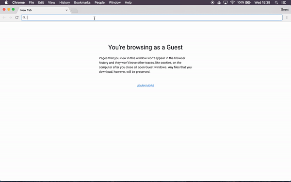

# Word-Counter Tech Test

A Javascript application which takes a book as an input text file and outputs how many times each word occurs in the book. It also displays whether the number of occurrences for each word is a prime number or not.

Have a go at [http://wordcounter-pw.herokuapp.com](http://wordcounter-pw.herokuapp.com/)



The application ignores irrelevant punctuation and capitalisation.
```
'Question' and 'Question?' are both counted as the same word.
'The' and 'the' are both counted as the same word.
"don't" is counted as a single word.
'mother-in-law' is counted as a single word.
```

### How to run the application

**1. Install node (if you haven't already)**
```
$ brew install node
```
**2. Clone and update repo**
```
$ git clone git@github.com/petewilkins/WordCounter.git
$ cd WordCounter
$ npm install
```
If you encounter any errors, update node package manager and try again.
```
$ npm update
```

**3. Tests**

Make sure you're in the WordCounter directory.

```
$ npm test
```
A window should open in your browser and run the tests using Jasmine.

**4. Run Application**

Make sure you're in the WordCounter directory.

```
$ npm start
```
- Head to `http://localhost:8000/` in your browser of choice!

**5. Error Handling**

Error messages are shown if the file selected is not a valid .txt or .html file.


### Technologies used

- [Vanilla JavaScript](https://www.javascript.com/)

- [Jasmine](https://jasmine.github.io/)
(Testing framework)

- [NodeJS](https://nodejs.org/en/)
(JavaScript runtime environment)

- [Heroku](https://herokuapp.com/)
(Application deployment)

### User Stories

```
As a User,
So that I can see the most common words used in a book,
I want to have a list of words in order of number of occurrences.
```
```
As a User,
So that I can how many times a word is used in a book,
I want to see the number of occurrences for each word.
```
```
As a User,
So that I can impress my friends with my prime number knowledge,
I want to see if the number of occurrences for each word is a prime number.
```
```
As a User,
So that I can count words in different books,
I want to be able to give a specific text file to be analysed.
```
